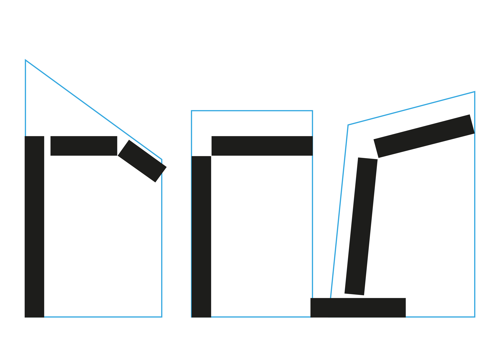
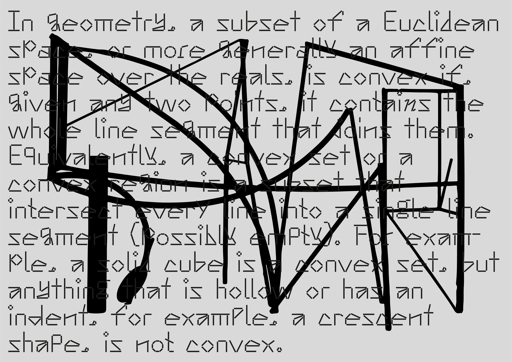
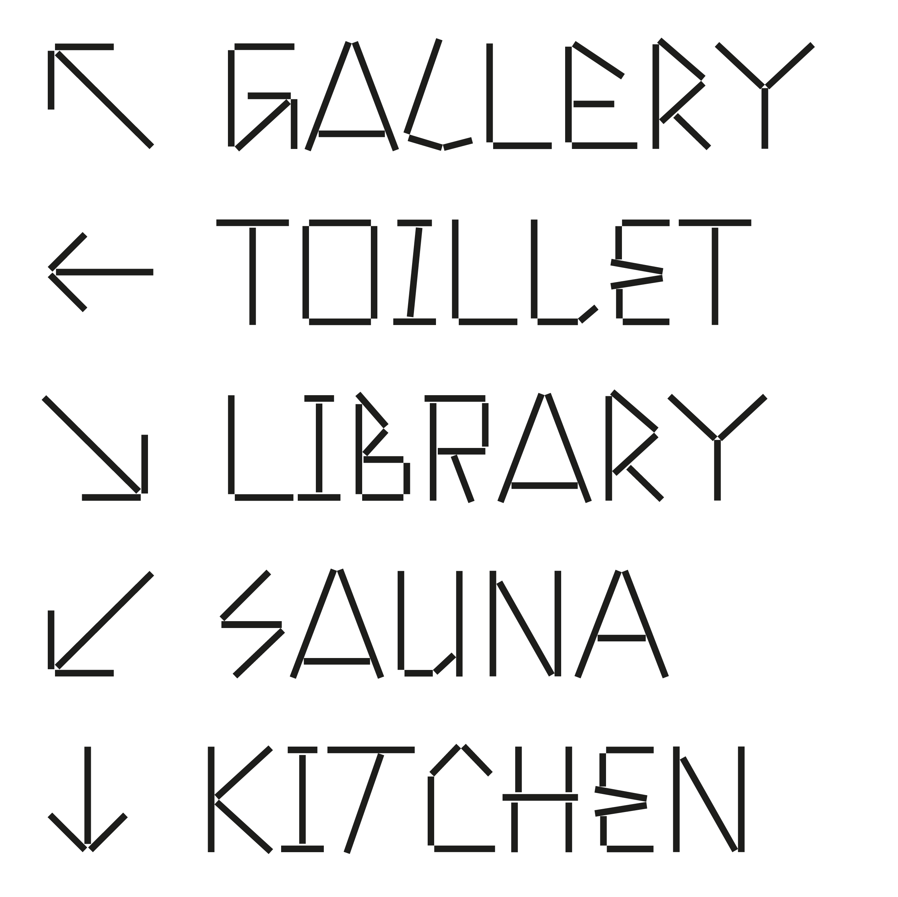
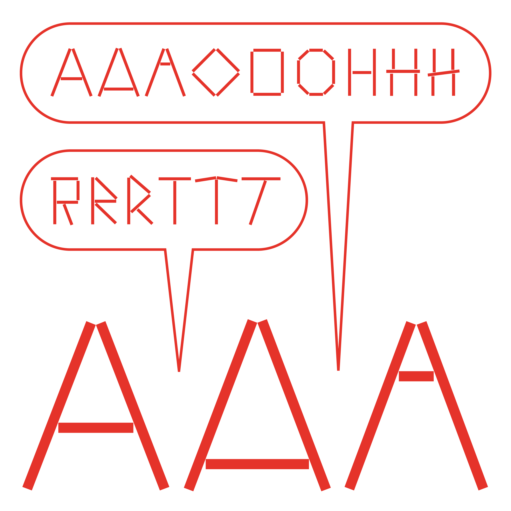

# Anthony

Anthony is a typeface designed by Sun Young Oh(hello@sunyoungoh.com) and inspired from artworks by Anthony Caro.
The form of this typeface comes from his sculptures that are leaning against each other.

——

Graphic designer Sun Young Oh’s focus lies in building and experimenting with new tools to create humour and play through design. She often applies random combinatorics through a self-generated system to produce unexpected visual results. She currently lives and works in Stuttgart, Germany.

www.sunyoungoh.com

## Specimen

## License

Anthony is licensed under the SIL Open Font License, Version 1.1.
This license is copied as an attached file, and is also available with a FAQ at
http://scripts.sil.org/OFL

## Repository Layout

This font repository follows the Unified Font Repository v2.0,
a standard way to organize font project source files. Learn more at
https://github.com/unified-font-repository/Unified-Font-Repository
